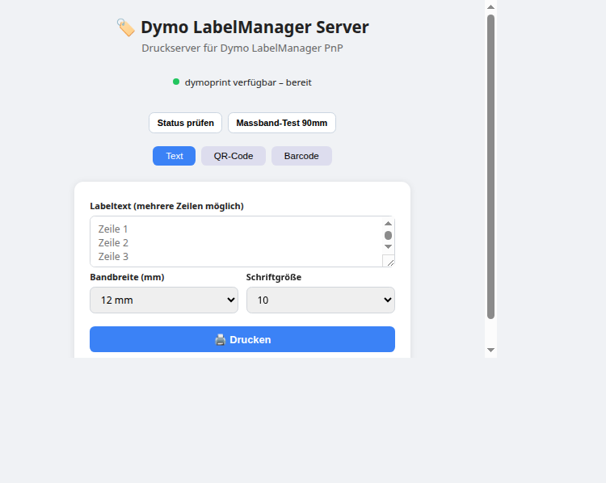
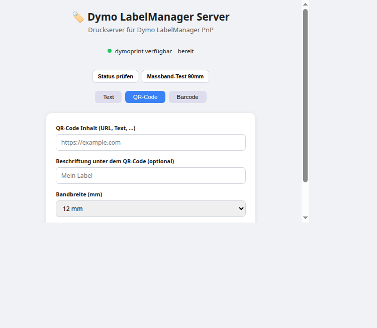
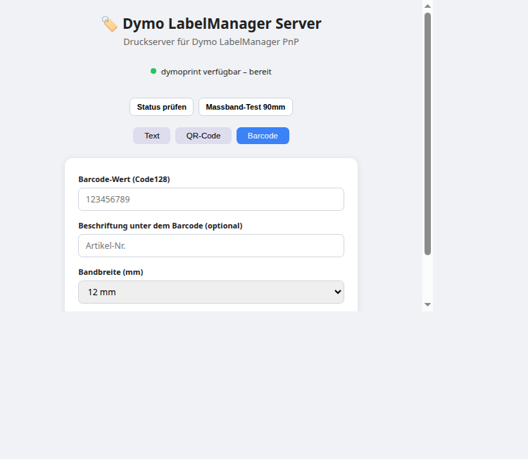

# dymoprintserver

Local-first Druckserver fuer DYMO LabelManager PnP auf Linux.

Features:
- REST API fuer Text-, QR- und Barcode-Labels
- Web UI fuer schnelle Bedienung im Browser
- Fixe Label-Gesamtlaenge (40 mm) fuer stabile Handhabung
- Kalibrierung fuer gemessenen 12-mm-Vorlauf bei DYMO PnP
- Massband-Testdruck (90 mm) zur Kalibrierung

## Screenshots

Text-Ansicht:

QR-Ansicht:

Barcode-Ansicht:

## Schnellstart (Endanwender)

Voraussetzungen:
- Linux
- USB angeschlossener DYMO LabelManager PnP
- Node.js 18+
- Python 3

Installation und Start:
1. npm install
2. npm run setup:local
3. npm run start:local
4. Browser oeffnen: http://localhost:3000

## USB Rechte (einmalig)

1. Regel anlegen:
   sudo tee /etc/udev/rules.d/99-dymo-labelmanager.rules >/dev/null <<'EOF'
   SUBSYSTEM=="usb", ATTR{idVendor}=="0922", MODE="0666", GROUP="plugdev"
   EOF
2. Regeln neu laden:
   sudo udevadm control --reload-rules
   sudo udevadm trigger
3. Drucker kurz abziehen und wieder anstecken

Pruefen:
- lsusb | grep -i dymo

## Wichtige Kalibrierungsregel

Fuer diesen Drucker gilt gemessen:
- Vor dem eigentlichen Inhalt bleiben etwa 12 mm leer (mechanischer Vorlauf)
- Danach beginnt erst der sichtbare Inhalt

Die Anwendung beruecksichtigt das bereits in der fixen Label-Logik.

## API

GET /api/status
- Prueft dymoprint Verfuegbarkeit

POST /api/print/text
Beispiel Body:
{
  "text": "Zeile 1\nZeile 2\nZeile 3",
  "tapeSize": 12
}

POST /api/print/qr
Beispiel Body:
{
  "qrContent": "https://example.com",
  "label": "optional",
  "tapeSize": 12
}

POST /api/print/barcode
Beispiel Body:
{
  "barcodeValue": "123456789",
  "label": "optional",
  "tapeSize": 12
}

POST /api/print/test-short
- Druckt ein Massband-Testlabel (90 mm)

## Entwicklerdokumentation

Projektstruktur:
- src/index.js: Express Server
- src/routes/print.js: API Endpunkte
- src/services/dymo.js: Druck-Integration, fixe Label-Renderpipeline
- scripts/generate_fixed_label.py: Rendering fuer fixe 40-mm-Labels
- scripts/generate_ruler_label.py: Rendering fuer Massband-Testdruck
- public/index.html: Web UI

Lokaler Dev-Loop:
1. npm install
2. npm run setup:local
3. npm run start:local
4. API testen mit curl oder Web UI

## Docker und Portainer

Vorbereitete Compose-Dateien:
- docker-compose.yml (lokal)
- docker-compose.test.yml (Port 8201)
- docker-compose.prod.yml (Port 8200)

Hinweis: Deployment nur nach expliziter Freigabe.

## Qualitaet und GitHub Standards

Enthaelt:
- MIT Lizenz
- Contributing Guide
- Security Policy
- Code of Conduct
- GitHub CI Workflow
- Issue Templates und PR Template

## Lizenz

MIT. Siehe LICENSE.
